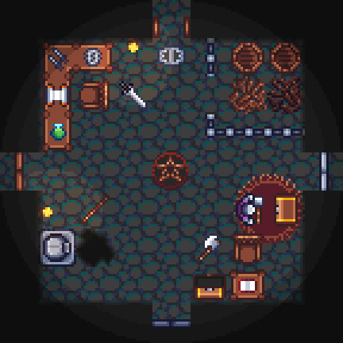

# Knights: Quest for Gems

Knights: Quest for Gems is a 2D top-down vs/coop dungeon-crawler game for 1 - 4 players.

This game is based on the original game "Knights" for Amiga, made by Kalle Marjola in 1994.  
You can find more infos on [his website](https://rpr.kapsi.fi/games/design.shtml#knights).

There's also an open-source port for PC (Windows/Linux/Mac) which can be found at:  
https://www.knightsgame.org.uk/.
