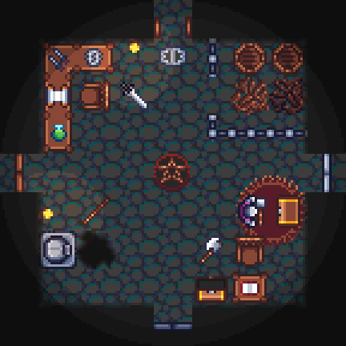

# Knights: Quest for Gems

> :warning: **Work in progress**: The game is not yet in a playable state!

## Overview 
Knights: Quest for Gems is a 2D top-down vs/coop dungeon-crawler game for 1 - 4 players.

This game is based on "Knights" for Amiga, made by Kalle Marjola in 1994.  
You can find more infos on [his website](https://rpr.kapsi.fi/games/design.shtml#knights).

There's also an open-source PC (Windows/Linux/Mac) port of the original game which can be found at:  
https://www.knightsgame.org.uk/.

## License
The software is released under the [GNU General Public License (GPL)](https://www.gnu.org/licenses/gpl-3.0.txt) which can be found in the file `COPYING` in the same directory as this file. Information about licenses for individual assets can be found in the `LICENSES` file which can be found in the same directory as the asset file.
